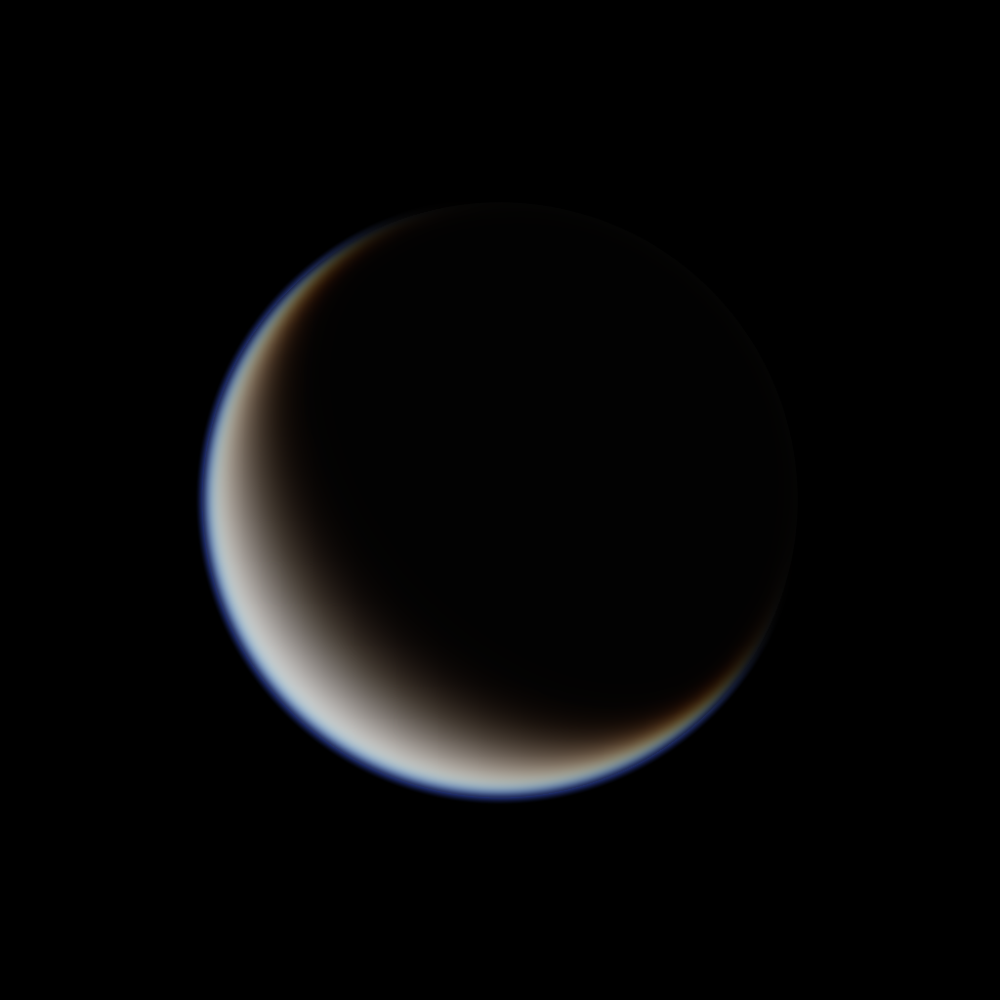
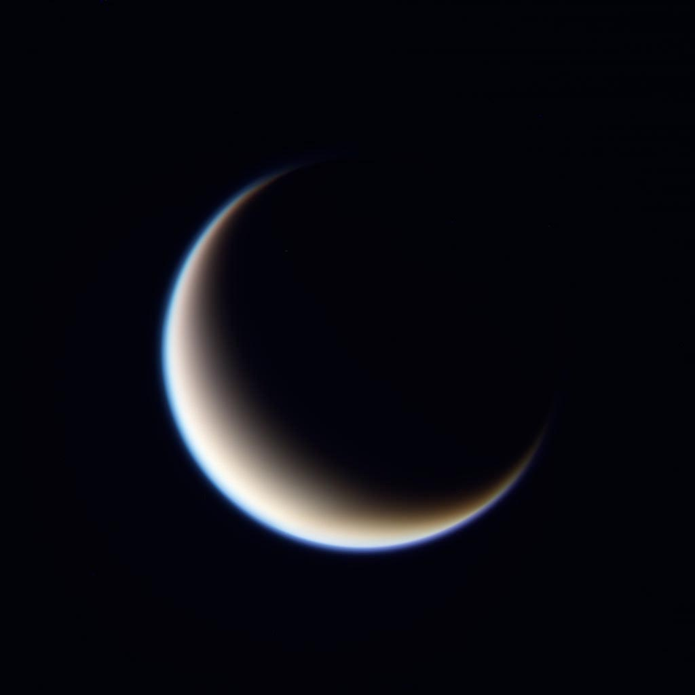

# [PovRay](http://www.povray.org/) model of Titan
This script render a synthetic image of Saturn moon Titan.

## Inputs
- Targeted planet: `Titan`
- Instrument: `Cassini ISS Narrow Angle Camera`
- Geometry:
	- Image ID: `N1827942759_1`
	- Time: `2015/12/04 16:48:52.903`
	- Observer: `0ºN - 302ºW @ 1,600,000 km`
	- Sun: `26ºN - 161ºW`
	- Camera rotation: `167º`

## Usage
```povray
#include "src/Titan.inc"
object { Titan }
```

### Synthetic image:



### Real image captured by Cassini:


**Source:**
RGB: [`N1827942726_1`](http://pdsimg.jpl.nasa.gov/data/cassini/cassini_orbiter/coiss_2100/extras/browse/1827259674_1828077733/N1827942726_1.IMG.jpeg) (RED/CL2)
/ [`N1827942759_1`](http://pdsimg.jpl.nasa.gov/data/cassini/cassini_orbiter/coiss_2100/extras/browse/1827259674_1828077733/N1827942759_1.IMG.jpeg) (CL1/GRN)
/ [`N1827942793_1`](http://pdsimg.jpl.nasa.gov/data/cassini/cassini_orbiter/coiss_2100/extras/browse/1827259674_1828077733/N1827942793_1.IMG.jpeg) (BL1/CL2)

## Titan Map
[Maps](./../tree/master/maps) folder contents Titan maps.

## Resources:
- [PovRay Posts](http://news.povray.org/povray.binaries.images/message/%3Cweb.4de3891cd55febddb4f109e70%40news.povray.org%3E/#%3Cweb.4de3891cd55febddb4f109e70%40news.povray.org%3E)
- [Willamette](http://www.willamette.edu/~gorr/classes/GeneralGraphics/Media/)
- [PovRay](http://www.povray.org/documentation/view/3.6.1/422/)
- [F. Lohmueller](http://www.f-lohmueller.de/pov_tut/interior/interior_30e.htm)