# Surface Global Maps
Global cylindrical map centered at (0ºN,180ºW).

## Maps
### [`ISS`](http://astrogeology.usgs.gov/search/map/Titan/Cassini/Global-Mosaic/Titan_ISS_P19658_Mosaic_Global_4km)
 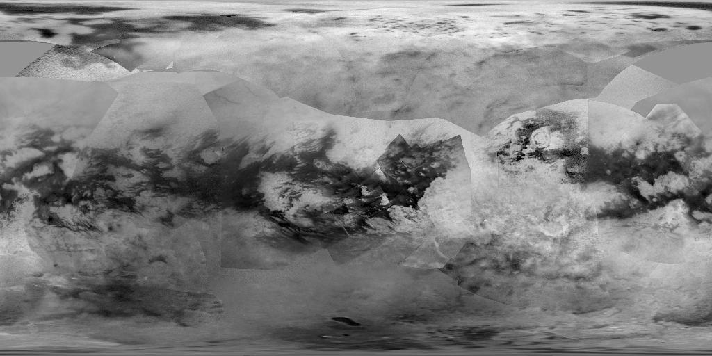
ISS @ 938 nm / T100 / June 2015

### [`ISS-color`](http://en.spaceengine.org/forum/17-3273-1)
 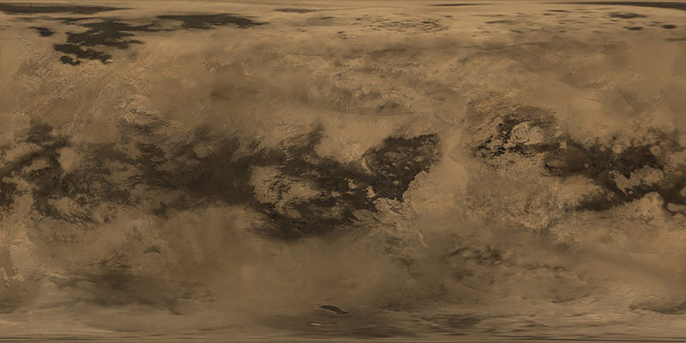
ISS color and smoothed / Nov 2015

### [`VIMS`](http://www.sciencedirect.com/science/article/pii/S0032063309001287)
 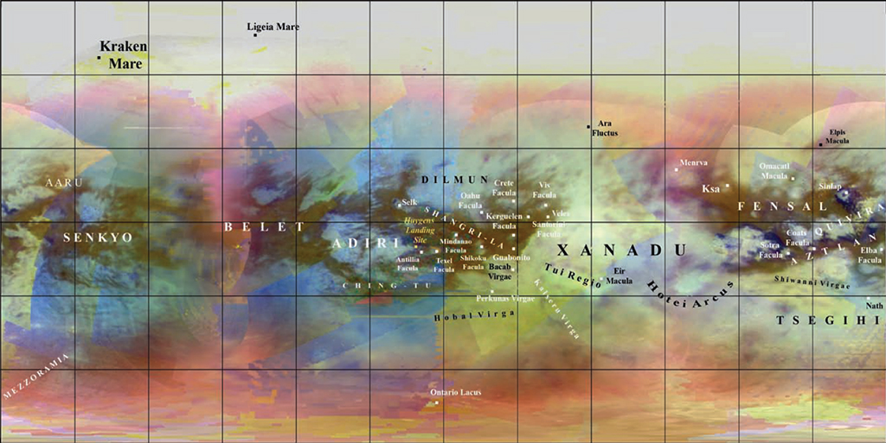
VIMS / RGB @ 4.8–5.2/2.0/1.27 μm / Barnes et al., 2009

### [`Radar`](http://astrogeology.usgs.gov/search/map/Titan/Cassini/Global-Mosaic/Titan_SAR_HiSAR_MosaicThru_T104_Jan2015_clon180_128ppd)
 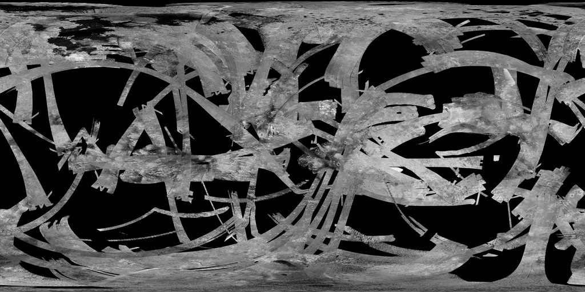
HiSAR / T104 / Jan 2015

### [`Radar-VIMS`](http://photojournal.jpl.nasa.gov/catalog/PIA20024)
 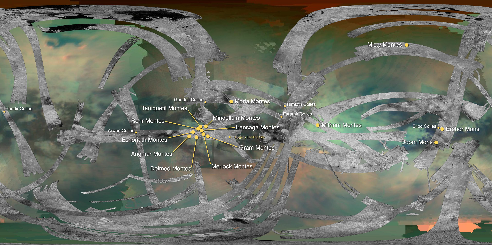
HiSAR + VIMS / March 2016

### [`Topo`](http://www.sciencedirect.com/science/article/pii/S0019103513001620)
 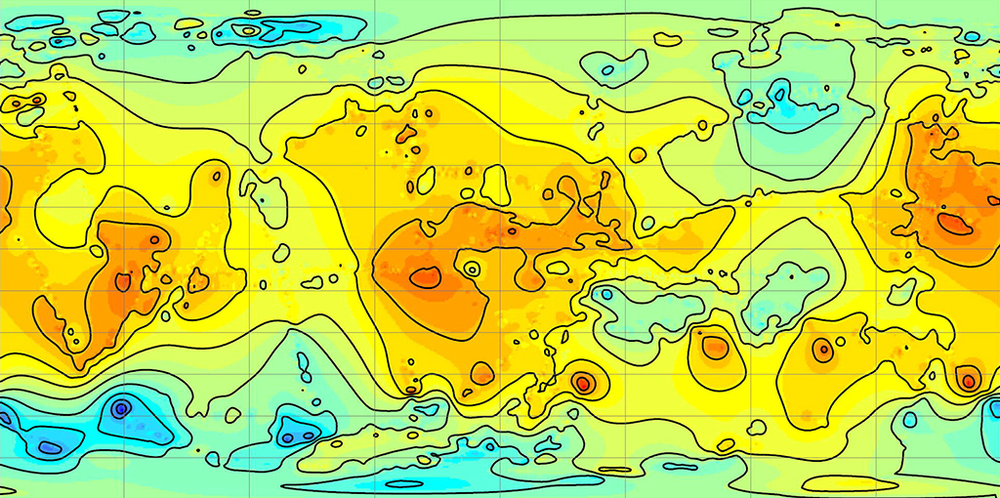
SARtopo / Lorentz et al., 2013

## Output
### [`ISS`](http://astrogeology.usgs.gov/search/map/Titan/Cassini/Global-Mosaic/Titan_ISS_P19658_Mosaic_Global_4km)
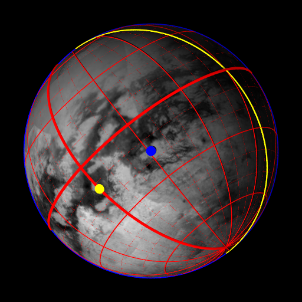

### [`ISS-color`](http://en.spaceengine.org/forum/17-3273-1)
 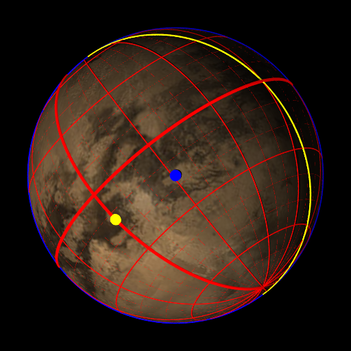

### [`VIMS`](http://www.sciencedirect.com/science/article/pii/S0032063309001287)
 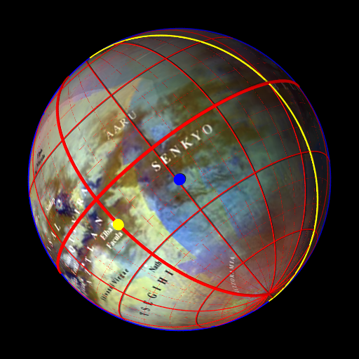

### [`Radar`](http://astrogeology.usgs.gov/search/map/Titan/Cassini/Global-Mosaic/Titan_SAR_HiSAR_MosaicThru_T104_Jan2015_clon180_128ppd)
 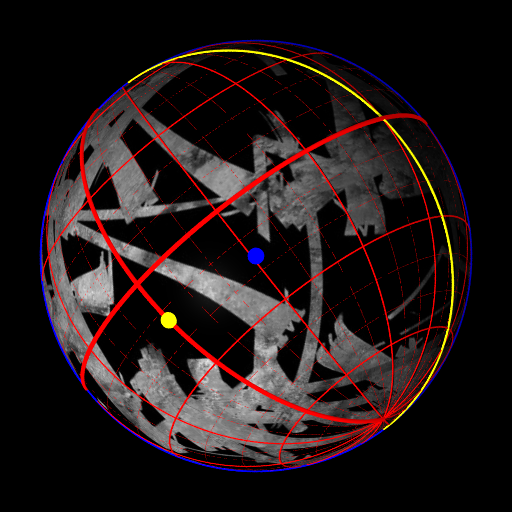

### [`Topo`](http://www.sciencedirect.com/science/article/pii/S0019103513001620)
 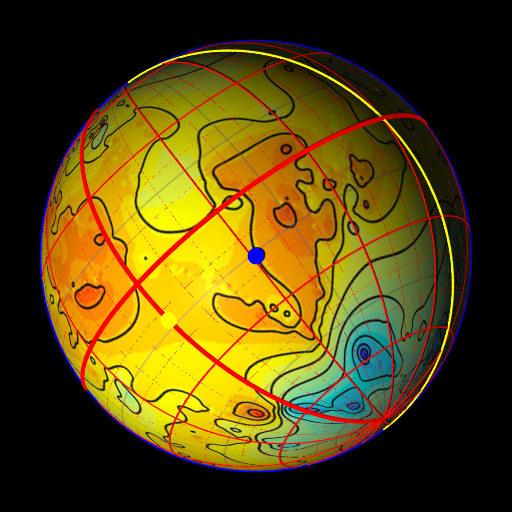
